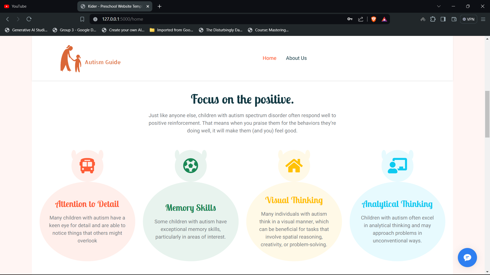
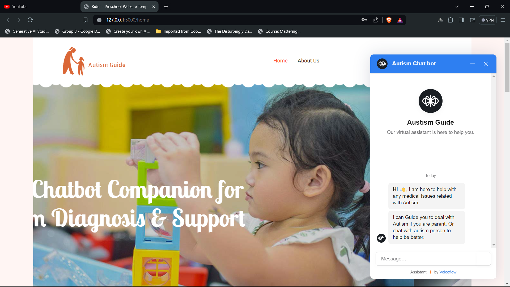

# Autism Early Diagnosis and Support Platform

<p align="center">
  
</p>

## Introduction

Welcome to the Autism Early Diagnosis and Support Platform! This platform aims to assist parents in the early diagnosis of autism in their children and provides an interactive chatbot that engages with children with autism as a friendly persona. The platform is built with Flask and includes an integrated chatbot powered by GPT-3.5 turbo.

## Features

1. **Early Diagnosis Guidance**: The chatbot guides parents through the process of early diagnosis of autism.
2. **Interactive Chatbot**: The chatbot interacts with children with autism as a friendly persona to provide support and companionship.
3. **User Authentication**: Secure login and signup system to ensure only authorized users can access the platform.
4. **Local Data Storage**: User data is stored locally using JSON files.

## Technologies Used

- **Backend**: Flask
- **Frontend**: HTML, CSS, JavaScript
- **Chatbot**: GPT-3.5 turbo
- **Data Storage**: JSON files

## Installation

To get started with the platform, follow these steps:

1. **Clone the repository**:
    ```bash
    git clone https://github.com/Mostafa10770/autism-platform.git
    cd autism-platform
    ```

2. **Install the required dependencies**:
    ```bash
    pip install -r requirements.txt
    ```

3. **Run the application**:
    ```bash
    python app.py
    ```

4. **Open your browser and navigate to**:
    ```
    http://127.0.0.1:5000/
    ```

## Usage

### User Authentication

1. **Signup**: Create an account by providing a username and password.
2. **Login**: Access the platform using your credentials.

### Chatbot Interaction

- **Parent Mode**: The chatbot guides parents through a series of questions to help in the early diagnosis of autism.
- **Child Mode**: The chatbot engages with children with autism as a friendly persona to provide support.

## Project Structure

```
autism-platform/
│
├── app.py                # Main application file
├── templates/            # HTML templates
│   ├── index.html        # Home page
│   ├── home.html         # User home page
│   ├── about.html        # About page
│
├── static/               # Static files (CSS, JS, images)
│   └── images/           # Directory for images
│       ├── overview.png  # Overview image for README
│       ├── website1.png  # Example website image 1
│       └── website2.png  # Example website image 2
│
├── data/                 # Directory for storing user data
│   └── users.json        # JSON file for user data
│
└── requirements.txt      # Required Python packages
```

## Examples


### Website Screenshots

<p align="center">
  
  
</p>


### Chatbot Video


Check out this video demonstration of the chatbot in action:
    
[](https://github.com/Mostafa10770/Autism-Guide/assets/98651655/17023a6b-e7dc-40af-a279-29ec95f0c210)


## Contributing

We welcome contributions to improve this platform. To contribute:

1. Fork the repository.
2. Create a new branch (`git checkout -b feature-branch`).
3. Commit your changes (`git commit -am 'Add new feature'`).
4. Push to the branch (`git push origin feature-branch`).
5. Create a new Pull Request.

## License

This project is licensed under the MIT License.

## Contact

For any questions or feedback, please contact:
- **Name**: Mostafa Hassan
- **Email**: mustafamagdy2002@gmail.com

Thank you for using the Autism Early Diagnosis and Support Platform! Together, we can make a difference.
